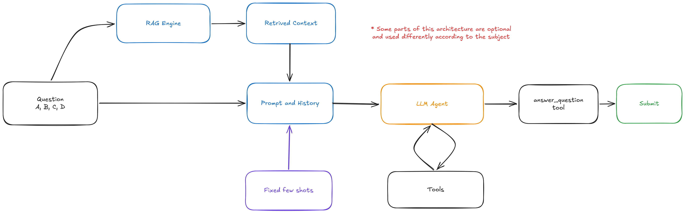
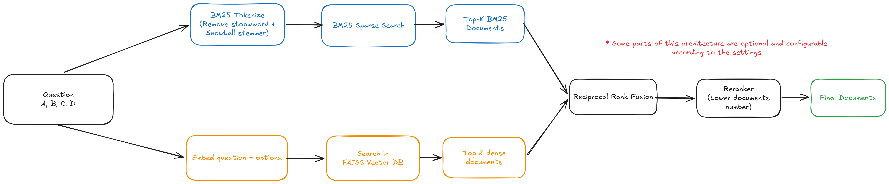
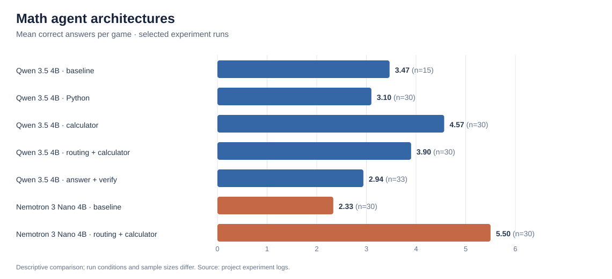

# PoliMillionaire — RAG Question-Answering Agent

**Project for the Natural Language Processing course (088946) at Politecnico di Milano.** We designed and benchmarked category-specific LLM agents for a *Who Wants to Be a Millionaire?* style quiz. The system combines domain knowledge retrieval (FAISS, BM25, and Reciprocal Rank Fusion), web search, mathematical tools, and speech recognition to answer multiple-choice questions under a time limit.

The [final notebook](NLPDef.ipynb) contains the implementation, experimental setup, plots, and discussion. This repository keeps the notebook and the most useful supporting artifacts in one place; the large datasets, vector indexes, and full run logs are linked or summarized separately.

## How the agent works

Each question is routed to an agent configured for its category. Depending on the task, the agent receives retrieved passages, calls a search or calculation tool, and submits one of four answer options. We experimented with several local models, prompts, retrieval settings, and tool combinations rather than using one configuration for every subject.

For knowledge-heavy categories, the retrieval system can combine semantic search over a FAISS index with lexical BM25 search. Reciprocal Rank Fusion (RRF) merges the two ranked lists; an optional reranker can narrow the context before it reaches the LLM. The indexes were built from domain-specific sources and split into 512-token chunks with 128-token overlap.

## Six quiz categories

| Category | Approach explored |
| --- | --- |
| **Entertainment** | A curated Wikipedia knowledge base for film, music, television, games, and pop culture, with retrieval and targeted web search. |
| **Ancient History** | An ancient-world Wikipedia index with civilization and topic metadata; experiments compared prompts, retrieval, and web search. |
| **Science & Nature** | Two complementary sources: SciQ support passages and selected Wikipedia articles. The experiments compared their coverage and retrieval performance. |
| **Philosophy & Psychology** | A focused Wikipedia index covering thinkers, schools, psychological concepts, ethics, and social and political thought. |
| **Mathematics** | Reasoning-oriented agents with `python_eval` or `simple_calc`, plus experiments with question classification and answer verification. Retrieval was less useful for these questions. |
| **News** | Web search and page fetching for recent facts that a static index or local model may not know. |

The final notebook discusses the best-performing setups and their failure modes by category. Across the factual categories, targeted external evidence was valuable; mathematics depended more on reasoning and calculation tools, while news depended on current web evidence.

## Experiments and results

We evaluated complete quiz sessions and logged answers, correctness, rewards, tool use, and timeouts. The notebook compares configurations using the number of correct answers per game, reward, and hit rates at later quiz levels. Because model speed, hardware, and the number of sessions vary between runs, the comparisons are descriptive.

Mathematics received the broadest architecture study. The chart below compares a small selection of runs; the [full math summary](results/math_summary.csv) and [session-level aggregates](results/math_selected_sessions.csv) are derived from the local logs without publishing question text or model transcripts. The [summary script](scripts/summarize_math_results.py) can regenerate these files from the original math logs.

## Speech mode

The quiz can provide spoken questions and answer options. In this mode, **Whisper** transcribes the audio, an optional small LLM corrects recognition errors and cleans the text, and the category agent answers the reconstructed question. The notebook includes a speech-mode experiment and discusses how transcription errors affect performance.

## Repository contents

| Path | Contents |
| --- | --- |
| [`NLPDef.ipynb`](NLPDef.ipynb) | Final implementation and analysis. Only a large, inline audio playback output was removed from the repository copy; code, prose, diagrams, and result plots remain. |
| [`builders/`](builders/) | Notebooks for the Ancient History, Science & Nature, and Philosophy/Psychology datasets and indexes, plus a SciQ–Wikipedia overlap analysis. |
| [`results/`](results/) | Compact math aggregates and small index build reports. |
| [`assets/`](assets/) | Pipeline diagrams from the final notebook and a chart generated from experiment logs. |

The Entertainment index is available with the shared artifacts below. A complete standalone builder for it was not present among the local project files, so it is not represented as reproducible here.

## Running the notebook

The final notebook was developed primarily in **Google Colab**, with Google Drive for project files and **Ollama** for local model serving. It also connects to the PoliMillionaire game service. To run experiments:

1. Install the packages in [`requirements.txt`](requirements.txt), or use the notebook's Colab setup cell.
2. Obtain the [datasets and prebuilt indexes](https://drive.google.com/drive/folders/1HQYDOqt1ygAyaJO-g8nkxdHiDkvIsiQG?usp=sharing) and place `Datasets/` and `Indexes/` in the project directory used by the notebook.
3. Make the course-provided `millionaire_client` Python package available in that directory to run live games.
4. Set your own project path, model endpoints, and game credentials in the notebook's `SETTINGS` cell, then run the setup and experiment cells you need.

The builders have their own data-source and Colab path settings. They document the index construction process; adjust those paths and source access before rerunning them. Full experiments additionally require the game service and enough resources to run the selected local models. The repository does not include model weights, the large vector indexes, raw quiz logs, or audio recordings.

## Project links

- [Project video](https://youtu.be/bc7QcoofzKg)
- [Demo video](https://youtu.be/ToAQ4uWxUiw)
- [Datasets and indexes](https://drive.google.com/drive/folders/1HQYDOqt1ygAyaJO-g8nkxdHiDkvIsiQG?usp=sharing)

The Wikipedia-based builders use the [Clean Wikipedia English Articles dataset](https://huggingface.co/datasets/DragonLLM/Clean-Wikipedia-English-Articles); the science fact index uses SciQ support passages. See the notebook and builder notebooks for selection and preprocessing details. Repository code is covered by the [MIT license](LICENSE); external datasets, models, and services have their own terms.

## Credits

**Nasty Language Processing** — Politecnico di Milano

- Francesco Caracciolo — francesco1.caracciolo@mail.polimi.it
- Xuwen Ye — xuwen.ye@mail.polimi.it
- Alessandro Trimarchi — alessandro.trimarchi@mail.polimi.it
- Michelangelo Stefanini — michelangelo.stefanini@mail.polimi.it
